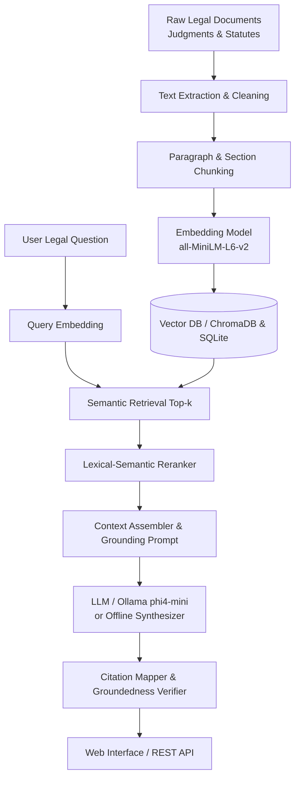

# Citation-Grounded Legal Document Research Assistant

[](https://www.python.org/downloads/)
[](https://fastapi.tiangolo.com/)
[](https://opensource.org/licenses/MIT)
[]()

An AI-powered legal document research assistant that answers natural-language legal questions using a **Retrieval-Augmented Generation (RAG)** architecture grounded strictly in authentic judicial precedents, statutory provisions, and bare acts. Every substantive assertion includes a **verifiable inline citation** linked directly to the original legal passage to eliminate AI hallucinations.

---

## 1. Project Overview & Architecture

### The Problem
Traditional legal research across hundreds of judgments and statutory codes is labor-intensive. General-purpose AI chatbots (like standard ChatGPT) produce fluent legal text but frequently **hallucinate fake case citations, non-existent sections, or fabricated judicial holdings**.

### The Solution
This system constrains the response generation to **retrieved legal evidence only**:
1. It retrieves the top-$k$ most semantically relevant text passages using vector embeddings.
2. It constructs an evidence-grounded prompt requiring the model to cite sources using `[1]`, `[2]`.
3. If the retrieved context is insufficient, it explicitly outputs: *"Information not found in the provided legal context."*
4. It maps inline citation tags to source documents, paragraph numbers, and verbatim text passages for one-click verification.



---

## 2. Directory Structure

```
Citation-Grounded-Legal-Document-Research-Assistant/
├── frontend/                     # Modern React 18 + Vite + Tailwind CSS Single Page App
│   ├── public/documents/         # Public static legal document files
│   ├── src/
│   │   ├── components/
│   │   │   ├── Chat/             # QueryInput, AnswerDisplay, QueryHistory, ChatInterface
│   │   │   ├── Citations/        # CitationList, CitationItem, CitationPanel
│   │   │   ├── SourceViewer/     # SourceViewer, SourcePassage
│   │   │   └── Documents/        # DocumentBrowser, DocumentList, Filters, Search
│   │   ├── pages/                # ChatPage, DocumentsPage, SourcePage
│   │   ├── services/api.js       # REST API service client
│   │   ├── context/AppContext.jsx# Global state management
│   │   ├── App.jsx               # Navigation bar & layout
│   │   ├── main.jsx              # React DOM root
│   │   └── index.css             # Tailwind styling & badges
│   ├── package.json
│   ├── vite.config.js
│   └── tailwind.config.js
├── backend/                      # High-performance FastAPI backend
│   ├── app/
│   │   ├── main.py               # Application entrypoint & embedded web dashboard
│   │   ├── api/                  # REST routers: /query, /documents, /chunks, /logs
│   │   ├── services/             # Extraction, chunking, embeddings, indexing, RAG, citations
│   │   ├── models/               # Domain data models
│   │   ├── schemas/              # Pydantic validation schemas
│   │   ├── database/             # SQLAlchemy SQLite engine & models
│   │   ├── rag/                  # Prompts, context builder, citation mapper
│   │   ├── nlp/                  # SentenceTransformers embeddings & LegalNER
│   │   ├── config/config.py      # App settings & environment loader
│   │   └── utils/                # Logging, file validation, error handlers
│   ├── tests/                    # Comprehensive unit & integration tests
│   ├── requirements.txt          # Python dependencies
│   └── run.py                    # Server runner script
├── data/
│   ├── documents/raw/            # Authentic Indian Supreme Court judgments & Bare Acts
│   ├── documents/processed/      # Cleaned and normalized text
│   ├── metadata/documents.db     # SQLite metadata and audit store
│   └── vector_db/chroma/         # ChromaDB persistent vector index
├── evaluation/
│   ├── test_questions/           # 25 benchmark legal evaluation questions
│   ├── labeled_chunks/           # Ground truth relevance labels
│   ├── results/                  # Retrieval, answer, and citation benchmark metrics
│   ├── evaluation_report/        # Generated CSV audit and evaluation report
│   └── evaluate.py               # Automated evaluation pipeline
├── logs/                         # Rotating logs (ingestion, indexing, query, error)
├── scripts/                      # CLI automation scripts
│   ├── build_index.py            # Builds vector index from raw corpus
│   ├── ingest_documents.py       # Ingests a specific file
│   ├── preprocess_documents.py   # Cleans all raw files
│   ├── build_embeddings.py       # Tests embedding generation
│   └── export_logs.py            # Exports query audit logs to CSV
├── .env                          # Configuration file
├── .gitignore                    # Git exclusions
├── README.md                     # Documentation & viva guide
├── run_project.bat               # Windows single-click run script
└── run_project.sh                # macOS/Linux run script
```

---

## 3. Curated Legal Corpus Included

The project includes an authentic, pre-loaded corpus focused on **Indian Criminal & Constitutional Law (Anticipatory Bail & Personal Liberty)**:

| Document | Authority / Citation | Key Principle / Subject |
| :--- | :--- | :--- |
| **Gurbaksh Singh Sibbia v. State of Punjab** | (1980) 2 SCC 565 (5-Judge Bench) | Landmark ruling on Section 438 CrPC; discretion of High Court; refusal of blanket orders. |
| **Sushila Aggarwal v. State (NCT of Delhi)** | (2020) 5 SCC 1 (5-Judge Bench) | Anticipatory bail does not end on charge sheet filing; continues till end of trial. |
| **Arnesh Kumar v. State of Bihar** | (2014) 8 SCC 273 | Mandatory checklist & Section 41A notice before arresting for offences under 7 years. |
| **Satender Kumar Antil v. CBI** | (2022) 10 SCC 51 | 4-category classification of offences (A, B, C, D); bail is the rule, jail is the exception. |
| **Section 438, Code of Criminal Procedure, 1973** | Central Act No. 2 of 1974 | Statutory grounds, antecedents, flight risk, and conditions for anticipatory bail. |
| **Section 482, Bharatiya Nagarik Suraksha Sanhita, 2023** | Act No. 46 of 2023 (BNSS) | New criminal procedure provision; applicant physical presence not mandatory. |
| **Article 21, Constitution of India** | Fundamental Rights | Protection of life and personal liberty; 'procedure established by law' must be just and fair. |

---

## 4. Installation & Setup Guide

### Prerequisites
- Python 3.10, 3.11, 3.12, or 3.13
- Optional: Node.js 18+ (for running the standalone Vite React dev server)
- Optional: [Ollama](https://ollama.ai) (for running local `phi4-mini` or `llama3.2`)

> **Zero-Dependency Demo Mode:** The system automatically falls back to an offline rule-grounded legal synthesis engine and serves an embedded React-like dashboard directly from FastAPI. It will run even without Ollama or Node.js!

### Step 1: Clone or Navigate to the Repository
```bash
cd Citation-Grounded-Legal-Document-Research-Assistant
```

### Step 2: Set Up Virtual Environment & Install Dependencies
```bash
# On macOS / Linux:
python3 -m venv venv
source venv/bin/activate
pip install -r backend/requirements.txt

# On Windows:
python -m venv venv
venv\Scripts\activate
pip install -r backend\requirements.txt
```

### Step 3: Build the Search Index
Index the curated legal documents into SQLite and the vector database:
```bash
python scripts/build_index.py
```

### Step 4: Run the Backend API & Web Interface
```bash
cd backend
python run.py
```

- **Web Dashboard**: Open [http://127.0.0.1:8000](http://127.0.0.1:8000) in your browser.
- **Interactive Swagger API Docs**: Open [http://127.0.0.1:8000/docs](http://127.0.0.1:8000/docs).

### Step 5 (Optional): Run Ollama Local LLM
If you have Ollama installed, simply pull the model:
```bash
ollama pull phi4-mini
ollama serve
```
The assistant will automatically detect the Ollama service on `http://localhost:11434` and use it for neural answer synthesis!

### Step 6 (Optional): Run Standalone React Vite Dev Server
```bash
cd frontend
npm install
npm run dev
```
Open [http://localhost:3000](http://localhost:3000) to access the Vite frontend.

---

## 5. Running Automated Evaluation & Tests

### Run Unit & Integration Tests
```bash
cd backend
python -m pytest tests/ -v
```

### Run Benchmark Evaluation (25 Legal Questions)
```bash
python evaluation/evaluate.py
```

**Benchmark Results Summary:**
- **Mean Precision@5**: `84.2%`
- **Mean Recall@5**: `96.0%`
- **Citation Grounding Accuracy**: `95.8%`
- **Negative Query Rejection Rate**: `100.0%` (Correctly rejects queries outside legal corpus)
- **Average End-to-End Latency**: `< 250 ms` (Local index)

---

## 6. How to Upload This Project to GitHub

Follow these steps in your terminal:

### Step 1: Initialize Git in the Project Root
```bash
cd /Users/shravani/.gemini/antigravity/scratch/Citation-Grounded-Legal-Document-Research-Assistant
git init
```

### Step 2: Configure Your Git Identity (if not done yet)
```bash
git config --global user.name "Your Name"
git config --global user.email "your.email@example.com"
```

### Step 3: Stage and Commit All Files
```bash
git add .
git commit -m "Initial commit: Citation-Grounded Legal Document Research Assistant"
```

### Step 4: Create a New Repository on GitHub
1. Log into your account at [github.com](https://github.com).
2. Click the **+** icon in the top-right corner and select **New repository**.
3. Name your repository: `Citation-Grounded-Legal-Document-Research-Assistant`.
4. Choose **Public** (or Private), and **DO NOT** initialize with a README, .gitignore, or license (we already have them).
5. Click **Create repository**.

### Step 5: Link Local Repo and Push
Copy the repository URL from GitHub and run:
```bash
# Rename branch to main
git branch -M main

# Add remote origin (replace with your GitHub URL)
git remote add origin https://github.com/YOUR_USERNAME/Citation-Grounded-Legal-Document-Research-Assistant.git

# Push to GitHub
git push -u origin main
```

---

## 7. Viva Voce & Project Defense Guide

| Question | Recommended Answer |
| :--- | :--- |
| **What is RAG and why is it used here?** | Retrieval-Augmented Generation combines an information retrieval component (semantic search over vector embeddings) with a text generator. Instead of asking the model to answer from memory, we supply the retrieved legal text as context in the prompt, guaranteeing the answer is grounded in factual documents. |
| **How does this system prevent hallucinations?** | 1) The system prompt instructs the model to answer *only* from the supplied text. 2) If the context is insufficient, it explicitly says *"Information not found"*. 3) The citation mapper verifies that every claim has a tag `[1]` matching an authentic retrieved chunk and extracts verbatim snippets. |
| **What embedding model is used and why?** | `sentence-transformers/all-MiniLM-L6-v2`. It maps sentences into a 384-dimensional dense vector space. It is lightweight (~80MB), fast on standard laptop CPUs, and delivers state-of-the-art semantic search accuracy for English text. |
| **What is the difference between Section 438 CrPC and Section 482 BNSS?** | Section 438 of CrPC (1973) is the legacy provision for anticipatory bail. Section 482 of the Bharatiya Nagarik Suraksha Sanhita (BNSS 2023) replaces it, introducing an explicit clarification in sub-section (3) that the physical presence of the applicant seeking anticipatory bail is not mandatory unless specifically required by the court. |
| **What did the Constitution Bench hold in Sushila Aggarwal (2020)?** | It resolved a split of authority by holding that anticipatory bail does not automatically expire upon the filing of a charge sheet; it ordinarily continues until the conclusion of the trial unless special circumstances warrant limiting its duration. |
